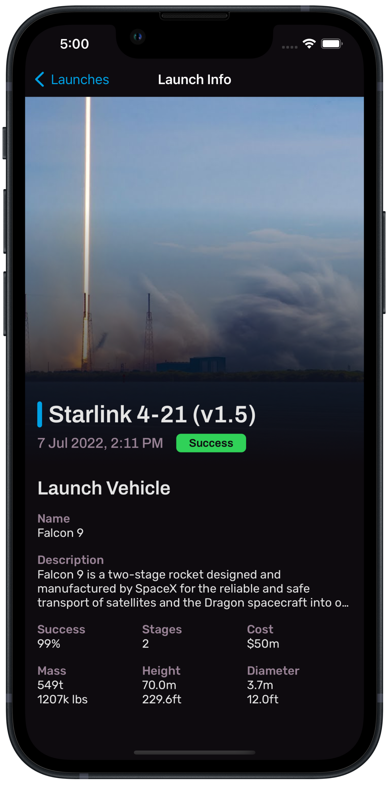

# TrackX for iOS

TrackX is a native iOS app built in Swift for viewing SpaceX launch information using [SpaceX-API](https://github.com/r-spacex/SpaceX-API). It provides a list of all previous and upcoming SpaceX launches, with details about each one, including: launch vehicle, launch site, landing pad, locations and more.

Learn more about previous SpaceX launches, and get the latest information about upcoming launches to make sure you never miss a moment.

## Features
- UI built programmatically using UIKit and AutoLayout
- Asynchronous network requests using URLSession
- Image caching using NSCache
- Map with relevant location annotations using MapKit

## How it looks...

  
   
  

