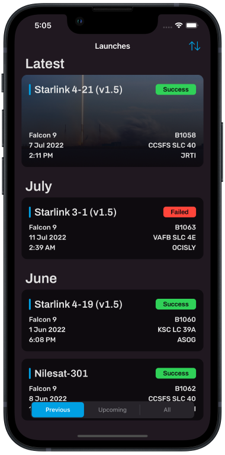
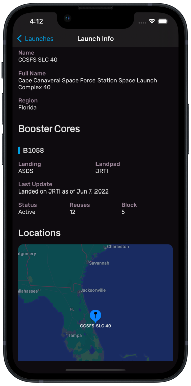

# TrackX for iOS

TrackX is a native iOS app built in Swift for viewing SpaceX launch information provided by [SpaceX-API](https://github.com/r-spacex/SpaceX-API). It displays a list of all previous and upcoming SpaceX launches, with details about each one, including: launch vehicle, launch site, landing pad, locations and more.

Check it out on the [App Store](https://apps.apple.com/us/app/trackx-for-rocket-launches/id1634008901).

## Features
- UI built programmatically using UIKit and AutoLayout constraints
- Asynchronous network requests using URLSession
- Parsing JSON data from public API
- Image caching using NSCache 
- Maps with location annotations using MapKit

## How it looks...

  
   
  

